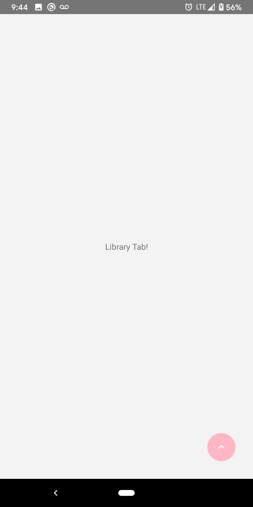
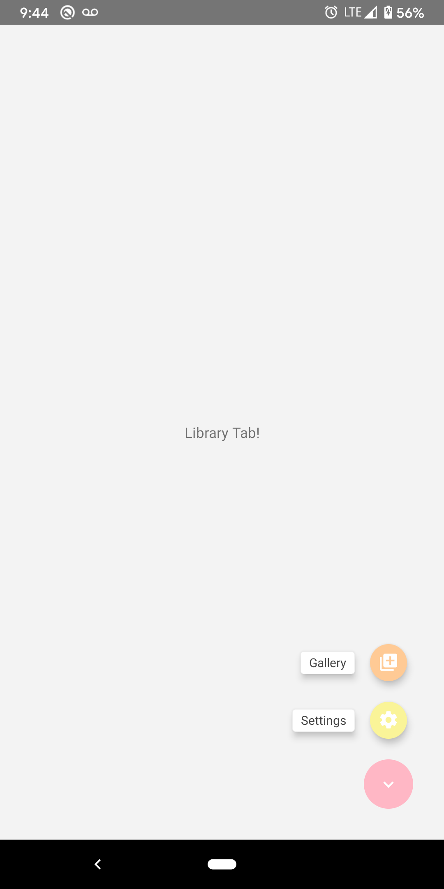
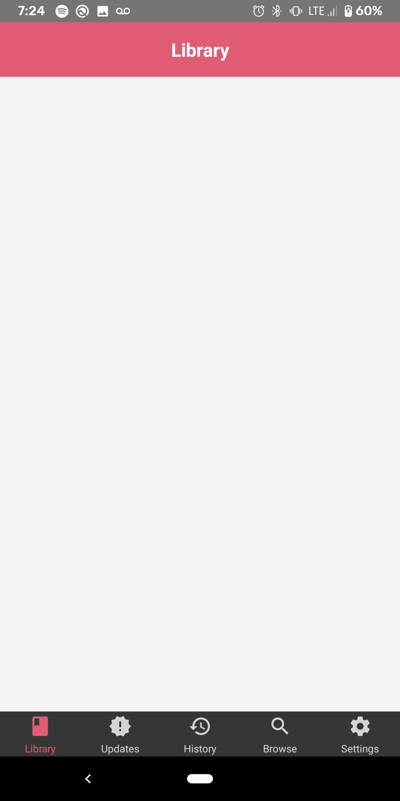
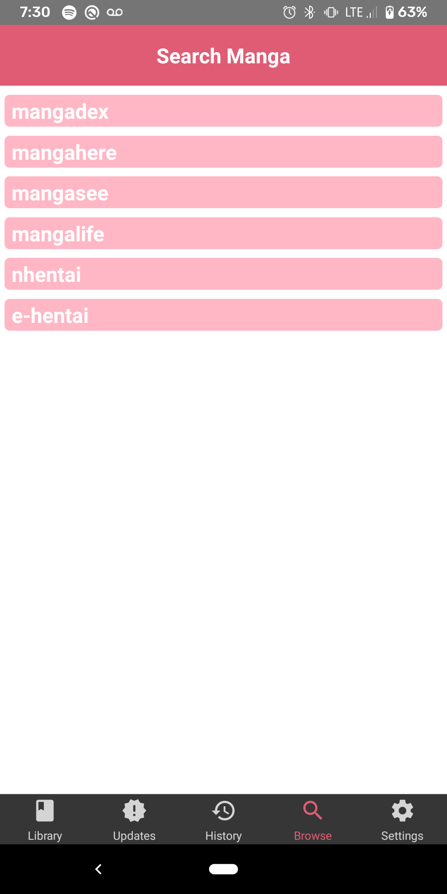
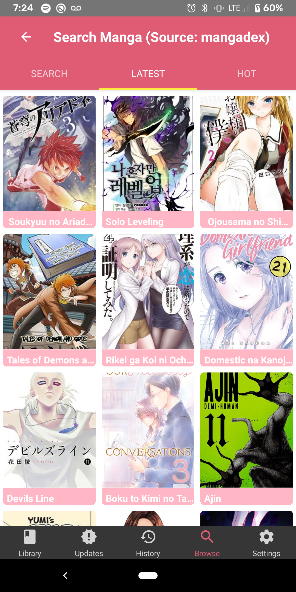

# Sakura

 An open source manga reader for android platforms.  ***In early stages.***

- [Sakura](#sakura)
- [Features](#features)
- [Getting Started](#getting-started)
	- [Usage](#usage)
	- [Screenshots](#screenshots)
- [Issues &amp; Contributing](#issues-amp-contributing)
	- [Testing &amp; Building](#testing-amp-building)
- [Credits](#credits)
	- [Documentation:](#documentation)
	- [License - GPL-3.0 LICENSE](#license---gpl-30-license)

# Features

`TODO`

# Getting Started

## Usage

`TODO`

## Screenshots

**Early Interface Design**

 

  

# Issues & Contributing

`TODO`

## Testing & Building

```bash
# running
yarn dev # in repo react native

react-native run-android # global react version

# testing
yarn test # run test cases

```

# Credits

## Documentation:

`TODO`

## License - [GPL-3.0 LICENSE](/LICENSE)
