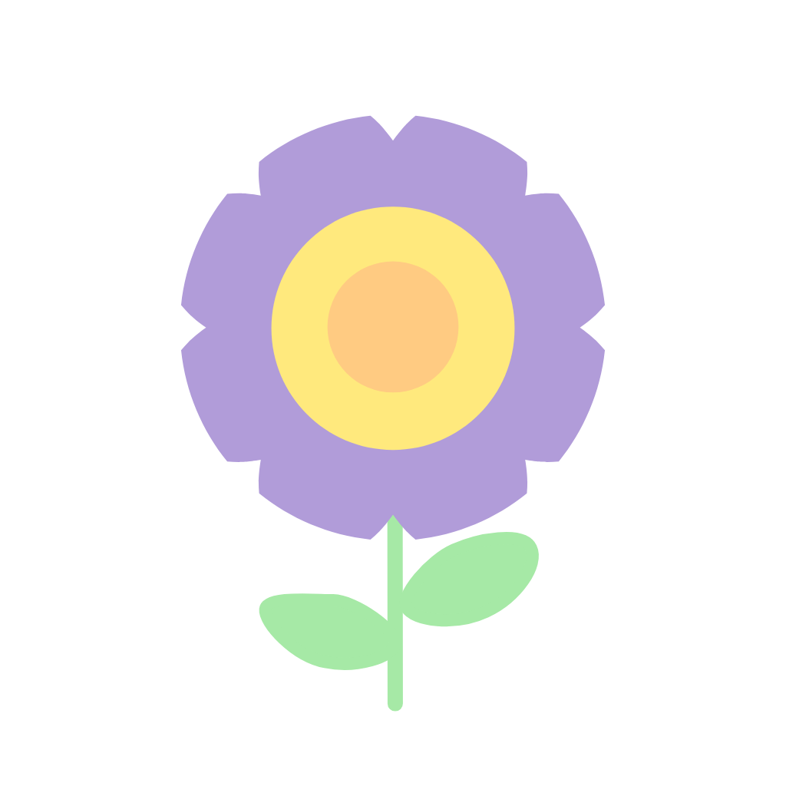
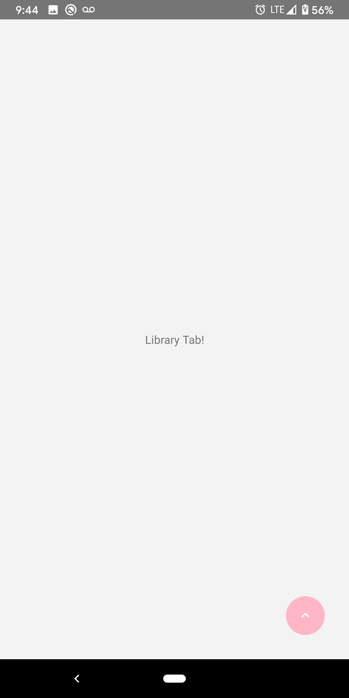
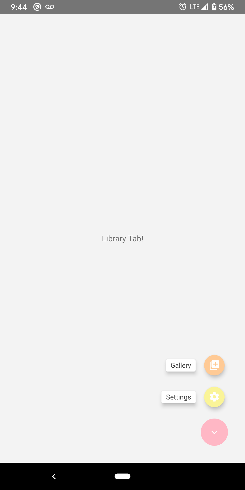
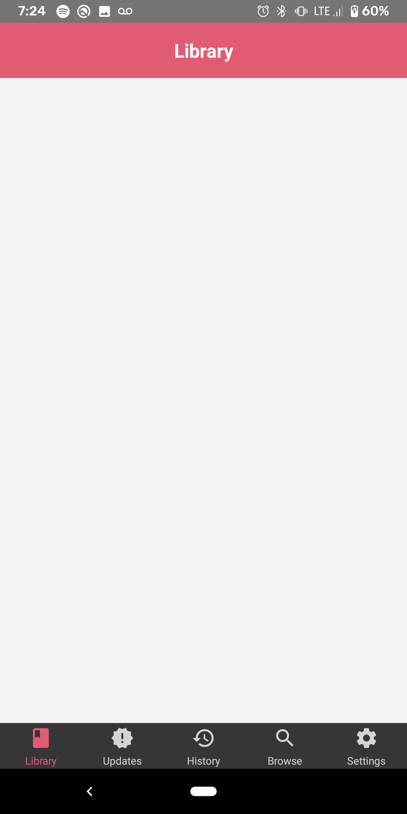
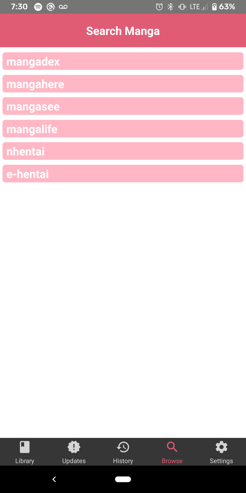
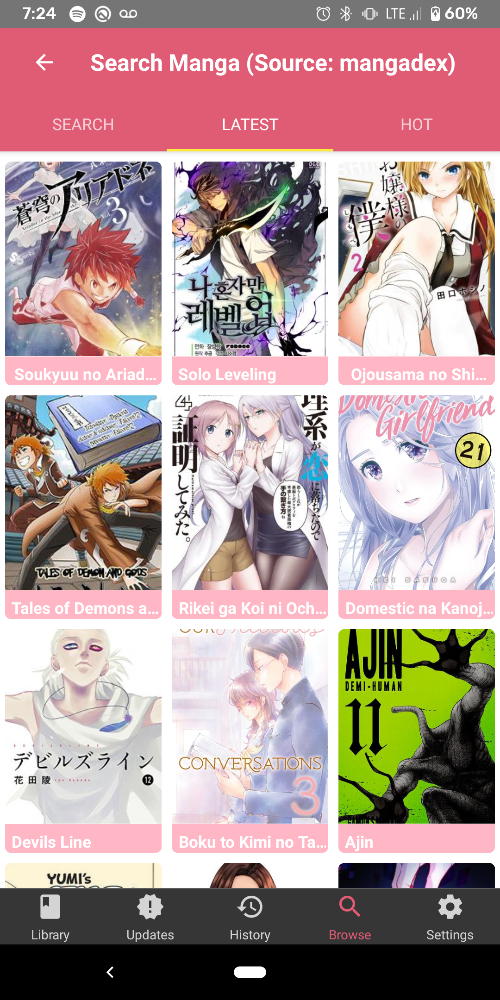
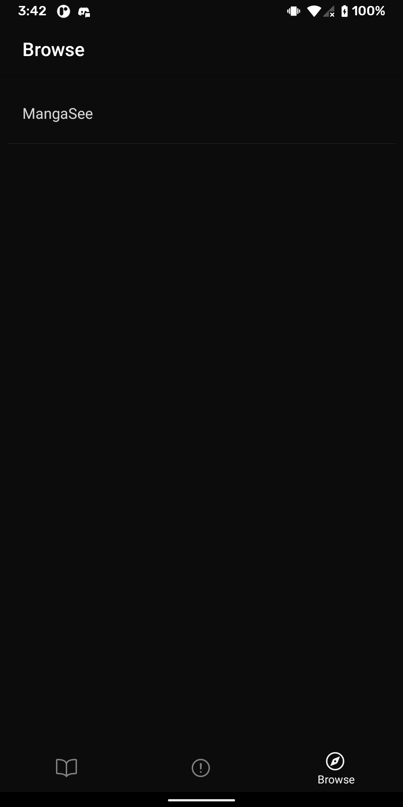
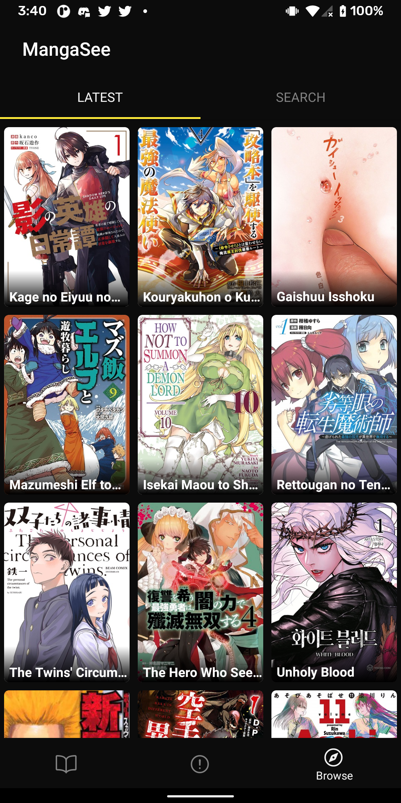

# **iizu.me**

<div align="center">


**free and open source API for browsing and downloading manga.**


[](https://github.com/songmawa/iizu.me/issues)

[](https://github.com/songmawa/iizu.me/blob/master/LICENSE)

</div>

## Screenshots

 

  

 

## Getting Started

### Dependancies

- [nodejs](https://nodejs.org/) >= 12.18.4
#### Tools
- [android-studio](https://developer.android.com/studio) >= 4.1.3
### Installing

#### 1. Download required libraries.
```sh
# Install all node libraries`:
yarn install
```

### Building
#### 1. TODO
```sh
# TODO
```

### Running

#### 1. TODO
```sh
# TODO
```

### Testing
```sh
# TODO
```

## Documentation

Specifications & design documents can be found in the [wiki](/wiki).

## See Also

- **iizu.me - https://github.com/songmawa/iizu.me**

## Contributing

Please see [CONTRIBUTING.md](CONTRIBUTING.md) for a in depth view.

## Credits

Please see [CREDITS.md](CREDITS.md) for a in depth view.

## License

This project is licensed under the **GPL-3.0** License - see the [LICENSE](LICENSE) file for details.
